

  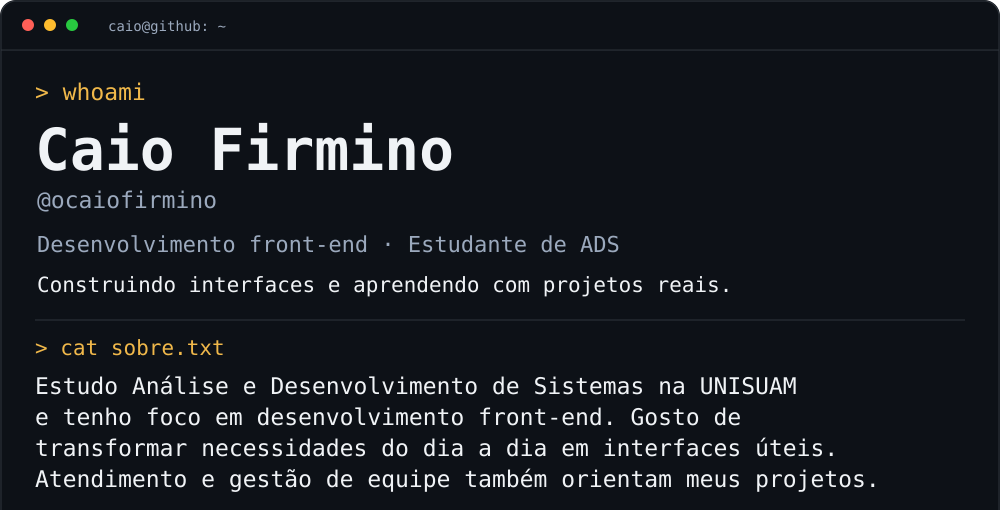
  <a href="https://portifolio-pessoal-beta-eight.vercel.app">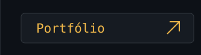</a><a href="https://www.linkedin.com/in/caio-firmino-115344236">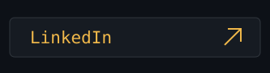</a><a href="https://github.com/ocaiofirmino?tab=repositories">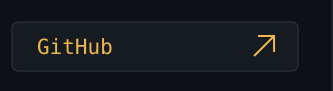</a>
  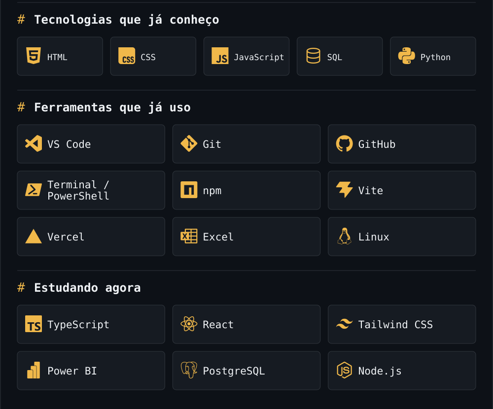
  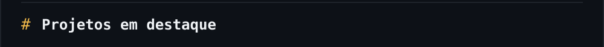
  <a href="https://zelo-financas.vercel.app">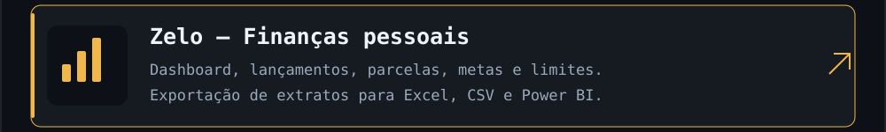</a>
  <a href="https://github.com/ocaiofirmino/fitmanager">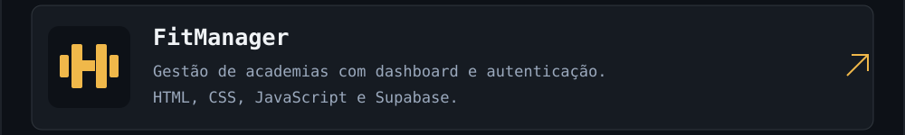</a>
  <a href="https://github.com/Junta-ai-br/junta-ai">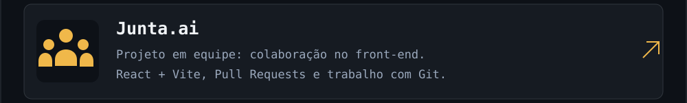</a>
  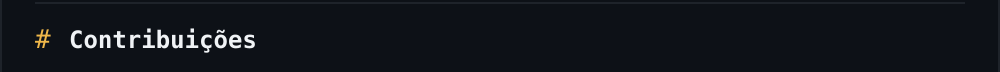
  
  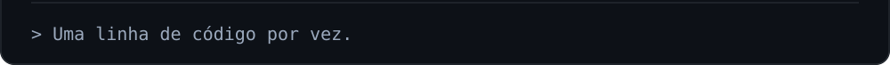

