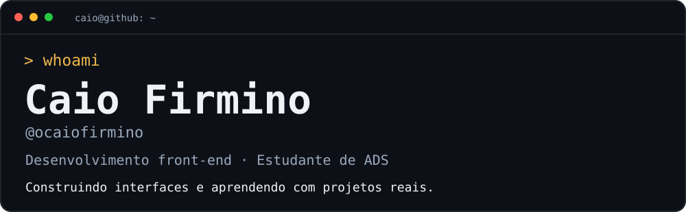
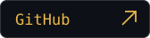
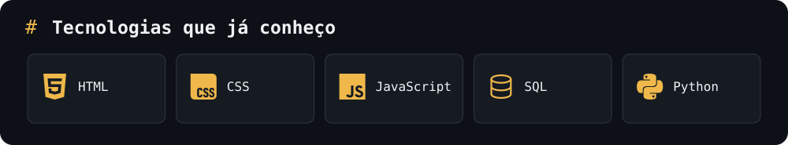
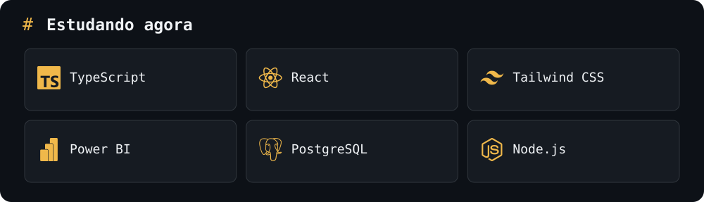
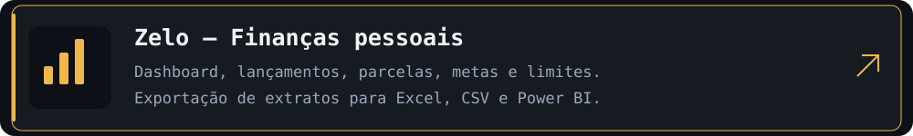
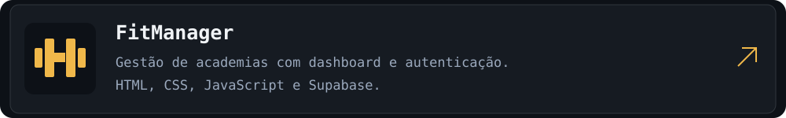

  

  
  
  

Estudo **Análise e Desenvolvimento de Sistemas na UNISUAM** e tenho foco em desenvolvimento front-end. Gosto de transformar necessidades do dia a dia em interfaces úteis. Minha experiência com atendimento e gestão de equipe também orienta como organizo meus projetos.

[`> ver projeto`](https://zelo-financas.vercel.app) · [`> ver código`](https://github.com/ocaiofirmino/zelo-financas)

[`> ver código`](https://github.com/ocaiofirmino/fitmanager)

[`> ver código`](https://github.com/Junta-ai-br/junta-ai)

  

